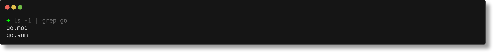

# termshot

[](https://github.com/homeport/termshot/blob/main/LICENSE)
[](https://goreportcard.com/report/github.com/homeport/termshot)
[](https://github.com/homeport/termshot/actions?query=workflow%3A%22Tests%22)
[](https://codecov.io/gh/homeport/termshot)
[](https://pkg.go.dev/github.com/homeport/termshot)
[](https://github.com/homeport/termshot/releases/latest)

Generate beautiful screenshots of your terminal, from your terminal.

```sh
termshot lolcat -f <(figlet -f big termshot)
```

This command generates this screenshot:


## Installation

To install with Homebrew on macOS or Linux:

```sh
brew install homeport/tap/termshot
```

See [Releases](https://github.com/homeport/termshot/releases/) for pre-compiled binaries for Darwin and Linux.

## Usage

This tool reads the console output and renders an output image that resembles a user interface window. It's inspired by some other web-based tools like [carbon.now.sh](https://carbon.now.sh/), and [codekeep.io/screenshot](https://codekeep.io/screenshot). Unlike those tools, `termshot` does not blindly apply syntax highlighting to some provided text; instead it reads the ANSI escape codes ("rich text") logged by most command-line tools and uses it to generate a high-fidelity "screenshot" of your terminal output.

Like `time`, `watch`, or `perf`, just prefix the command you want to screenshot with `termshot`.

```sh
termshot ls -a
```

This will generate an image file called `out.png` in the current directory.


In some cases, if your target command contains _pipes_—there may still be ambiguity, even with `--`. In these cases, wrap your command in double quotes.

```sh
termshot -- "ls -1 | grep go"
```



### Flags to control the look

#### `--show-cmd`/`-c`

Include the target command in the screenshot.

```sh
termshot --show-cmd -- "ls -a"
```


#### `--columns`/`-C`

Enforce that screenshot is wrapped after the provided number of columns. Use this flag to make sure that the screenshot does not exceed a certain horizontal length.

#### `--no-decoration`

Do not draw window decorations (minimize, maximize, and close button).

#### `--no-shadow`

Do not draw window shadow.

#### `--margin`/`-m`

Add extra space (margin) around the window.

### Flags for output related settings

#### `--clipboard`/`-b` (only on selected platforms)

Do not create an output file with the screenshot, but save the screenshot image into the operating system clipboard.

_Note:_ Only available on some platforms. Check `termshot` help to see if flag is available.

#### `--filename`/`-f`

Specify a path where the screenshot should be generated. This can be an absolute path or a relative path; relative paths will be resolved relative to the current working directory. Defaults to `out.png`.

```sh
termshot -- "ls -a" # defaults to <cwd>/out.png
termshot --filename my-image.png -- "ls -a"
termshot --filename screenshots/my-image.png -- "ls -a"
termshot --filename /Desktop/my-image.png -- "ls -a"
```

### Flags to control content

#### `--edit`/`-e`

Edit the output before generating the screenshot. This will open the rich text output in the editor configured in `$EDITOR`, using `vi` as a fallback. Use this flag to remove unwanted or sensitive output.

```sh
termshot --edit -- "ls -a"
```

### Miscellaneous flags

#### `--raw-write <file>`

Write command output as-is into the file that is specified as the flag argument. No screenshot is being created. The command-line flag `--filename` has no effect, when `--raw-write` is used.

#### `--raw-read <file>`

Read input from provided file instead of running a command. If this flag is being used, no pseudo terminal is being created to execute a command. The command-line flags `--show-cmd`, and `--edit` have no effect, when `--raw-read` is used.

#### `--version`/`-v`

Print the version of `termshot` installed.

```sh
$ termshot --version
termshot version 0.2.5
```

### Multiple commands

In order to work, `termshot` uses a pseudo terminal for the command to be executed. For advanced use cases, you can invoke a fully interactive shell, run several commands, and capture the entire output. The screenshot will be created once you terminate the shell.

```sh
termshot /bin/zsh
```

> _Please note:_ This project is work in progress. Although a lot of the ANSI sequences can be parsed, there are definitely commands in existence that create output that cannot be parsed correctly, yet. Also, commands that reset the cursor position are known to create issues.
